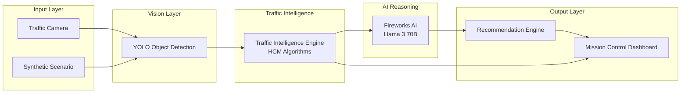

# VayuGati Flow

> **Urban Decision Intelligence: Simulate Traffic Interventions Before They Hit the Street**

VayuGati Flow is an **AI-powered Digital Twin platform** for urban traffic management. It analyzes congestion from camera feeds and synthetic scenarios, identifies root causes, simulates countermeasures, and recommends optimized traffic strategies **before** deployment in the real world.

[](https://www.python.org/)
[](https://fastapi.tiangolo.com/)
[](https://docs.pydantic.dev/)
[](https://react.dev/)
[](https://www.typescriptlang.org/)
[](https://tailwindcss.com/)
[](https://playwright.dev/)
[](LICENSE)


---

## Screenshot Section

> Replace the placeholders below with real screenshots as the project evolves. Store final assets in `docs/images/`.

### Mission Control Dashboard


### System Architecture


### Traffic Simulation


### AI Recommendation Panel


### API Response


### Interactive Map


### Live Demo


---

## Why VayuGati Flow

### The Urban Congestion Problem

Urban traffic congestion is one of the costliest inefficiencies in modern cities:

- **Wasted time:** commuters lose hundreds of hours per year in gridlock.
- **Fuel consumption:** stop-and-go traffic burns excess fuel and increases emissions.
- **Delayed emergency response:** every minute of congestion can be critical for ambulances and fire services.
- **Economic drag:** logistics, freight, and local commerce suffer from unpredictable travel times.
- **Reactive systems:** most existing tools only respond after congestion has already formed, leaving little room for prevention.

### Current Limitations

Traditional traffic management systems rely on:

- Static signal timing plans that do not adapt to live conditions.
- Fragmented data sources (CCTV, loop detectors, Waze) that are hard to correlate.
- Human-in-the-loop decision making during incidents.
- Limited ability to test "what-if" interventions before rolling them out.

### Why Digital Twins Solve This

A **Digital Twin** mirrors a physical intersection in software. VayuGati Flow closes the loop between sensing, reasoning, and action:

1. **Observe** live or synthetic traffic through computer vision.
2. **Analyze** deterministic traffic metrics grounded in the Highway Capacity Manual (HCM).
3. **Reason** with a large language model to explain congestion and propose interventions.
4. **Simulate** the impact of changes before they are deployed.
5. **Recommend** the best strategy to traffic operators.

### Business Impact

| Stakeholder | Benefit |
|-------------|---------|
| City Traffic Control | Data-driven incident response and signal planning |
| Urban Planners | Evidence-based infrastructure decisions |
| Emergency Services | Faster right-of-way planning during incidents |
| Logistics Operators | Predictable travel time corridors |
| Citizens | Reduced congestion, emissions, and commute stress |

### Expected Benefits

- **Proactive congestion management:** identify and address bottlenecks before they cascade.
- **Faster incident response:** automatically flag accidents, illegal parking, and emergency vehicles.
- **Lower operational risk:** simulate signal or lane changes in software first.
- **Transparent AI decisions:** deterministic metrics plus explainable LLM reasoning.
- **API-first architecture:** easy to integrate with existing ITS, city dashboards, or command centers.

---

## Key Features

- **Digital Twin Engine** — Real-time and synthetic intersection modeling with camera, vehicle, and signal abstractions.
- **Computer Vision** — Base64 image ingestion with YOLO-based vehicle detection and bounding-box extraction.
- **YOLO Detection** — Object detection pipeline for cars, trucks, buses, motorcycles, bicycles, pedestrians, and emergency vehicles.
- **AI Reasoning** — Fireworks AI (Llama 3 70B) explanations, root-cause identification, and actionable recommendations.
- **Scenario Simulation** — Five pre-configured demo scenarios: Morning Rush, School Zone, Accident, Illegal Parking, and Emergency Vehicle.
- **REST APIs** — End-to-end pipeline, traffic analysis, vision analysis, and reasoning endpoints with standardized responses.
- **Mission Control Dashboard** — Dark-themed React/TypeScript dashboard with MapLibre GIS map, live metrics, and AI insights.
- **Traffic Analytics** — HCM-based queue length, density, occupancy, average speed, congestion score, Level of Service (LOS), and risk score.
- **Multi-Agent Pipeline** — Composable Vision, Traffic Intelligence, and Reasoning agents orchestrated through a clean service layer.

---

## System Architecture



---

## Repository Structure

```
VayuGati-Flow/
├── ai_agents/                  # Agent prompts and reasoning orchestration
├── api/                          # OpenAPI specs and API contract artifacts
├── assets/                       # Static assets (logos, diagrams, sample media)
├── backend/                      # FastAPI backend
│   ├── app/
│   │   ├── config.py             # Pydantic-settings configuration
│   │   ├── models/               # Domain models (Vehicle, Intersection, Camera, Signal)
│   │   ├── routers/              # FastAPI route handlers
│   │   ├── schemas/              # Pydantic v2 request/response schemas
│   │   ├── services/             # Business logic: Vision, Traffic, Reasoning, Pipeline
│   │   └── utils/                # Shared utilities and response helpers
│   ├── tests/                    # Pytest suite (149 tests)
│   ├── main.py                   # FastAPI application entry point
│   ├── requirements.txt          # Python dependencies
│   └── pytest.ini               # Pytest configuration
├── docs/                         # Project documentation
│   ├── README.md                 # Documentation navigation
│   ├── SYSTEM_OVERVIEW.md        # High-level system overview
│   ├── architecture.md           # Deep-dive architecture guide
│   ├── developer-guide.md        # Developer onboarding
│   ├── deployment.md             # Deployment runbook
│   ├── images/                   # Screenshots and diagrams
│   ├── prd/                      # Product Requirements Document
│   ├── testing/                  # Testing runbooks
│   └── via/                      # VayuGati Intelligence Architecture
├── examples/                     # Example requests and usage scripts
├── frontend/                     # React + TypeScript + Vite dashboard
│   ├── src/
│   │   ├── components/           # React components (panels, map, charts)
│   │   ├── data/               # GIS and scenario data
│   │   ├── hooks/              # Custom React hooks
│   │   ├── types/              # TypeScript type definitions
│   │   └── utils/              # Utility functions
│   ├── tests/                  # Playwright E2E and visual tests
│   ├── package.json            # Node dependencies and scripts
│   └── playwright.config.ts    # Playwright configuration
├── simulation/                 # Traffic simulation utilities
├── LICENSE                       # MIT License
└── README.md                     # This file
```

---

## Quick Start

### Prerequisites

- **Python** 3.11 or higher (Python 3.13 recommended)
- **Node.js** 18 or higher
- **npm** 9 or higher
- Optional: **Fireworks AI API key** for live LLM reasoning
- Optional: **YOLO model weights** for live computer vision

### Backend

```bash
cd backend
python -m venv .venv
source .venv/bin/activate        # Linux/macOS
# .venv\Scripts\activate          # Windows
pip install -r requirements.txt

# Optional: configure environment variables
cp .env.example .env              # if available

# Start the API server
uvicorn main:app --reload
```

The backend is now running at `http://localhost:8000`.
Interactive API docs are available at `http://localhost:8000/docs`.

### Frontend

```bash
cd frontend
npm install

# Configure environment variables
cp .env.example .env

# Start the Vite dev server
npm run dev
```

The dashboard is now running at `http://localhost:5173` (or `http://localhost:3000` depending on your Vite version).

### Run a Demo Scenario via API

```bash
curl -X POST http://localhost:8000/api/v1/pipeline/demo \
  -H "Content-Type: application/json" \
  -d '{
    "scenario": "morning_rush",
    "intersection_id": "INT-001",
    "camera_id": "CAM-001",
    "frame_id": "FRM-001"
  }'
```

List all scenarios:

```bash
curl http://localhost:8000/api/v1/pipeline/scenarios
```

---

## API Documentation

All endpoints are prefixed with `/api/v1` and return a standardized `APIResponse` envelope.

### Available Endpoints

| Method | Endpoint | Description |
|--------|----------|-------------|
| `GET` | `/` | Health check with version and API prefix |
| `POST` | `/api/v1/traffic/analyze` | HCM-based traffic analysis from domain models |
| `POST` | `/api/v1/vision/analyze` | YOLO object detection from base64 image |
| `POST` | `/api/v1/reasoning/analyze` | AI root-cause analysis and recommendations |
| `POST` | `/api/v1/pipeline/demo` | End-to-end demo pipeline |
| `GET` | `/api/v1/pipeline/scenarios` | List available demo scenarios |

### Example Request: Pipeline Demo

```bash
curl -X POST http://localhost:8000/api/v1/pipeline/demo \
  -H "Content-Type: application/json" \
  -d '{
    "scenario": "accident",
    "intersection_id": "INT-001",
    "camera_id": "CAM-001",
    "frame_id": "FRM-001",
    "lane_count": 4,
    "lane_length_meters": 100,
    "free_flow_speed_kmh": 60,
    "capacity_vehicles_per_hour": 1800
  }'
```

### Example Response

```json
{
  "success": true,
  "data": {
    "scenario": "accident",
    "intersection_id": "INT-001",
    "total_vehicles": 21,
    "vision_detections": 21,
    "vision_inference_time_ms": 0.0,
    "queue_length_meters": 92.5,
    "vehicle_density_vehicles_per_km": 210.0,
    "average_speed_kmh": 2.86,
    "occupancy_rate": 0.63,
    "congestion_score": 0.95,
    "level_of_service": "F",
    "risk_score": 0.92,
    "congestion_explanation": "Severe congestion detected...",
    "probable_root_causes": [
      "Blocked lanes due to accident",
      "Emergency vehicle requiring right-of-way"
    ],
    "traffic_recommendations": [
      "Dispatch traffic police to the intersection",
      "Preempt signal for emergency vehicle",
      "Reroute traffic via alternate corridors"
    ],
    "ai_confidence": 0.88,
    "pipeline_duration_ms": 245.3
  },
  "errors": null
}
```

For full request/response schemas, see the interactive docs at `http://localhost:8000/docs` or `docs/prd/09-api-specification.md`.

---

## Demo Scenarios

| Scenario | Traffic | Risk | LOS | Description |
|----------|---------|------|-----|-------------|
| **Morning Rush** | 48 vehicles (cars + trucks) | 0.55 | D | High peak-hour volume with moderate congestion |
| **School Zone** | 25 vehicles + stopped cars | 0.72 | E | Reduced speeds, pedestrian activity, many stopped vehicles |
| **Accident** | 20 stopped cars + emergency vehicle | 0.92 | F | Blocked lanes, severe congestion, emergency response |
| **Illegal Parking** | 12 moving + 5 parked vehicles | 0.48 | D | Obstructed travel lanes causing localized slowdown |
| **Emergency Vehicle** | 25 cars + emergency vehicle | 0.78 | E | Priority vehicle requiring right-of-way through traffic |

---

## Testing

### Backend Tests

The backend test suite uses **Pytest** and covers algorithms, services, schemas, and API integration.

```bash
cd backend
python -m pytest tests/ -v
```

**Coverage summary:**

| Area | Tests |
|------|-------|
| Traffic algorithms | 27 |
| Traffic analysis service | 13 |
| Computer vision service | 9 |
| Reasoning service | 11 |
| API integration | 45 |
| Schema validation | 21 |
| Traffic service | 23 |
| **Total** | **149** |

### Frontend Tests

The frontend uses **Playwright** for end-to-end and visual regression testing.

```bash
cd frontend
npx playwright install chromium    # first time only
npm run test:e2e
```

**What is tested:**

- Map initialization and traffic layers
- Camera and vehicle marker rendering
- Console error and network-failure detection
- Responsive screenshots at multiple viewports and zoom levels
- Deterministic vehicle animation frame

**Current status:** 10 Playwright suites passing.

For more details, see [`docs/testing/playwright.md`](docs/testing/playwright.md).

---

## Documentation

- [`docs/README.md`](docs/README.md) — Documentation navigation guide
- [`docs/SYSTEM_OVERVIEW.md`](docs/SYSTEM_OVERVIEW.md) — System architecture and data flow
- [`docs/architecture.md`](docs/architecture.md) — Deep-dive architecture documentation
- [`docs/developer-guide.md`](docs/developer-guide.md) — Developer onboarding and workflows
- [`docs/deployment.md`](docs/deployment.md) — Deployment runbook
- [`docs/prd/`](docs/prd/) — Full Product Requirements Document
- [`docs/via/`](docs/via/) — VayuGati Intelligence Architecture
- [`docs/testing/playwright.md`](docs/testing/playwright.md) — Playwright testing guide

---

## Roadmap

### Phase 1 — Foundation ✅

- [x] Digital Twin MVP
- [x] Deterministic HCM traffic engine
- [x] YOLO computer vision integration
- [x] Fireworks AI reasoning integration
- [x] REST API with standardized responses
- [x] Mission Control Dashboard
- [x] Pytest + Playwright test infrastructure

### Phase 2 — Operational Readiness 🚧

- [ ] Real-time video streaming via WebSocket
- [ ] Multi-intersection city network analysis
- [ ] Historical data persistence (PostgreSQL / time-series store)
- [ ] Authentication and role-based access control
- [ ] CI/CD pipeline with automated tests

### Phase 3 — Scale & Autonomy

- [ ] City-wide deployment and horizontal scaling
- [ ] Reinforcement learning signal control optimization
- [ ] Mobile app for field operators
- [ ] Digital-twin-driven scenario marketplace
- [ ] Edge deployment on traffic cabinets / IoT gateways

### Future Vision

VayuGati Flow aims to become an open **Urban Decision Intelligence Operating System**: a composable AI platform where cities, integrators, and researchers can plug in new data sources, simulation models, and control policies to continuously improve urban mobility.

---

## Contributing

We welcome contributions from engineers, researchers, designers, and domain experts.

1. **Fork** the repository and create a descriptive branch.
2. **Follow** the conventions in [`docs/developer-guide.md`](docs/developer-guide.md) and [`docs/STYLE_GUIDE.md`](docs/STYLE_GUIDE.md).
3. **Test** your changes: run `pytest` in `backend/` and `npm run test:e2e` in `frontend/`.
4. **Document** new features, API changes, and architectural decisions.
5. **Open a pull request** with a clear description and references to any related issues or ADRs.

For documentation-specific contributions, see [`docs/CONTRIBUTING.md`](docs/CONTRIBUTING.md).

---

## License

VayuGati Flow is licensed under the **MIT License**. See [`LICENSE`](LICENSE) for details.

---

<p align="center">Built with intent for smarter cities.</p>
