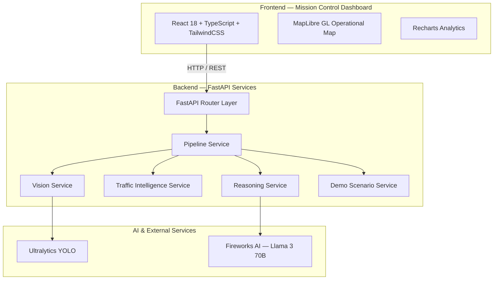

# VayuGati Flow — Architecture Documentation

This document describes the architecture of VayuGati Flow at multiple levels: high-level system design, component responsibilities, request sequencing, data flow, deployment topology, and future scaling.

---

## High-Level Architecture

VayuGati Flow is a modular, API-first Digital Twin platform. The system is organized as a pipeline of independent engines that can be composed, tested, and deployed separately.



### Architectural Principles

1. **Modularity:** Each engine is an independent service with a single responsibility.
2. **Determinism First:** Traffic metrics are computed with deterministic HCM algorithms before any AI reasoning.
3. **API-First:** Every capability is exposed through a typed REST API.
4. **Composability:** Engines can be wired together in different pipelines.
5. **Graceful Degradation:** Mock fallbacks exist for YOLO and Fireworks AI when they are unavailable.
6. **Type Safety:** Full Pydantic v2 coverage in the backend and TypeScript coverage in the frontend.

---

## Component Responsibilities

### Frontend Components

| Component | Responsibility | Technology |
|-----------|----------------|------------|
| `TopBar` | System health, city context, alerts, scenario selector | React + Lucide |
| `LeftPanel` | Camera feed, connector status, YOLO detections, vehicle counts | React |
| `MainArea` | Operational map, intersection selection, layer controls | MapLibre GL |
| `RightPanel` | Traffic intelligence, AI reasoning, decision impact | React + Recharts |
| `BottomPanel` | Mission timeline, scenario timeline, historical trends | React + Recharts |

### Backend Components

| Component | Responsibility | Key Files |
|-----------|----------------|-----------|
| **FastAPI App** | HTTP server, CORS, router registration, health endpoint | `backend/main.py` |
| **Vision Service** | YOLO inference on base64 images; vehicle detection extraction | `backend/app/services/computer_vision_service.py` |
| **Traffic Intelligence Service** | HCM-based queue, density, speed, LOS, risk calculations | `backend/app/services/traffic_analysis_service.py` |
| **Reasoning Service** | LLM prompt construction, root-cause analysis, recommendations | `backend/app/services/reasoning_service.py` |
| **Pipeline Service** | Orchestrates Vision → Traffic → Reasoning | `backend/app/services/pipeline_service.py` |
| **Demo Scenarios** | Pre-configured synthetic vehicle detections | `backend/app/services/demo_scenarios.py` |
| **Pydantic Models** | Domain models: VehicleDetection, Intersection, Camera, Signal | `backend/app/models/` |
| **Schemas** | Request/response DTOs with validation | `backend/app/schemas/` |

### External Services

| Service | Role | Fallback |
|---------|------|----------|
| **Ultralytics YOLO** | Object detection on traffic images | Mock detections for testing |
| **Fireworks AI** | LLM reasoning for explanations and recommendations | Deterministic mock responses based on congestion score |

---

## Sequence Diagram

The following diagram illustrates a complete end-to-end request through the demo pipeline.

```mermaid
sequenceDiagram
    participant UI as Mission Control Dashboard
    participant API as FastAPI Backend
    participant PS as Pipeline Service
    participant DS as Demo Scenario Service
    participant VS as Vision Service
    participant TS as Traffic Intelligence Service
    participant RS as Reasoning Service

    UI->>API: POST /api/v1/pipeline/demo
    API->>PS: analyze_from_detections()
    PS->>DS: get_vehicle_detections(scenario)
    DS-->>PS: List[VehicleDetection]

    Note over PS,VS: Vision stage skipped in demo; detections provided by scenario.
    PS->>VS: Optional: analyze_image()
    VS-->>PS: VisionAnalysisResponse

    PS->>TS: analyze_traffic(detections, intersection)
    TS-->>PS: TrafficAnalysisResult

    PS->>RS: analyze_traffic(metrics)
    RS-->>PS: ReasoningResponse

    PS-->>API: PipelineResult
    API-->>UI: APIResponse[PipelineResponse]
```

---

## Data Flow

### Complete Pipeline Flow

```
1. INPUT: Camera Image OR Synthetic Scenario Detections
   │
   ▼
2. VISION ENGINE (Optional in Demo)
   - YOLO object detection
   - Vehicle classification
   - Bounding box extraction
   - Speed estimation
   │
   ▼
3. TRAFFIC INTELLIGENCE ENGINE
   - Queue length calculation
   - Vehicle density calculation
   - Average speed calculation
   - Occupancy rate calculation
   - Congestion score calculation
   - Level of Service (LOS) determination
   - Risk score calculation
   │
   ▼
4. REASONING ENGINE
   - Congestion explanation generation
   - Root cause identification
   - Traffic recommendations
   - Confidence scoring
   │
   ▼
5. OUTPUT: Standardized APIResponse
   - Traffic metrics
   - AI insights
   - Recommendations
```

### Data Models

The domain model layer ensures consistency across engines:

- **VehicleDetection** — Detected object with class, confidence, bounding box, speed, direction.
- **Intersection** — Intersection geometry, type, lane configuration, and status.
- **Camera** — Camera metadata, resolution, field of view, and operational status.
- **TrafficSignal** — Signal state and timing information.
- **TrafficAnalysisResult** — Deterministic metrics produced by the Traffic Intelligence Engine.
- **ReasoningResponse** — Natural-language explanations and recommendations from the AI Reasoning Engine.

---

## Deployment Architecture

### Development Deployment

```
┌─────────────────┐      HTTP       ┌──────────────────┐
│   Vite Dev      │ ───────────────▶ │   FastAPI Dev    │
│   Server :5173  │                  │   Server :8000   │
└─────────────────┘                  └──────────────────┘
                                            │
                                            ▼
                                     ┌──────────────────┐
                                     │ YOLO / Fireworks │
                                     │ (optional)       │
                                     └──────────────────┘
```

### Production Deployment (Recommended)

```
                         ┌──────────────┐
                         │   CDN /      │
                         │   Static     │
                         │   Hosting    │
                         └──────┬───────┘
                                │
                                ▼
┌──────────┐           ┌──────────────────┐          ┌──────────────┐
│   User   │──────────▶│   Load Balancer  │──────────▶│   FastAPI    │
│  Client  │           │   (nginx / ALB)  │          │   App Server │
└──────────┘           └──────────────────┘          └──────┬───────┘
                                                            │
                             ┌──────────────────────────────┼──────────────┐
                             │                              │              │
                             ▼                              ▼              ▼
                        ┌─────────┐                 ┌──────────┐   ┌──────────┐
                        │ Fireworks│                 │  YOLO    │   │  Redis   │
                        │    AI    │                 │ Service  │   │  Queue   │
                        └─────────┘                 └──────────┘   └──────────┘
```

### Containerization Strategy

| Container | Responsibility | Notes |
|-----------|----------------|-------|
| `vayugati-api` | FastAPI backend | Stateless, horizontally scalable |
| `vayugati-dashboard` | React static build | Served via nginx or CDN |
| `vayugati-yolo` | Optional YOLO inference worker | GPU-recommended for production |
| `vayugati-redis` | Task queue and caching | Needed for streaming / scaling phases |

---

## Future Scaling Architecture

As VayuGati Flow moves from single-intersection demos to city-wide operations, the following scaling patterns are planned:

### 1. Event-Driven Streaming

Replace synchronous HTTP pipeline calls with an event-driven architecture:

- **MQTT / Kafka ingestion** for live camera frames and IoT telemetry.
- **Redis Streams / RabbitMQ** to buffer frames for Vision workers.
- **WebSocket channels** to push real-time updates to the dashboard.

### 2. Microservices Decomposition

Split the monolithic FastAPI app into focused services:

- `vision-service` — Frame ingestion, YOLO inference, detection tracking.
- `traffic-service` — Deterministic metric calculation.
- `reasoning-service` — LLM explanations and recommendations.
- `commander-service` — Decision orchestration and policy enforcement.
- `history-service` — Time-series persistence and analytics.

### 3. Geographic Scaling

- **City mesh:** multi-intersection graph with shortest-path rerouting.
- **MapLibre / Deck.gl layers:** real-time congestion overlays across the city.
- **Edge nodes:** lightweight inference on traffic cabinets near cameras.

### 4. Data Persistence

- **PostgreSQL** for domain metadata (intersections, cameras, signals).
- **TimescaleDB / InfluxDB** for high-frequency metrics and detection history.
- **S3 / MinIO** for frame storage and model artifacts.

### 5. ML Ops Integration

- **Model registry** for YOLO variants tuned to local vehicle types.
- **Evaluation pipeline** for LLM prompt performance and recommendation quality.
- **A/B testing** for signal policies in simulation before live deployment.

---

## Related Documentation

- [`SYSTEM_OVERVIEW.md`](SYSTEM_OVERVIEW.md) — Concise architecture summary and MVP scope.
- [`prd/06-system-architecture.md`](prd/06-system-architecture.md) — PRD system architecture chapter.
- [`prd/07-digital-twin.md`](prd/07-digital-twin.md) — Digital Twin product requirements.
- [`developer-guide.md`](developer-guide.md) — Local development and coding standards.
- [`deployment.md`](deployment.md) — Deployment runbook and environment variables.
