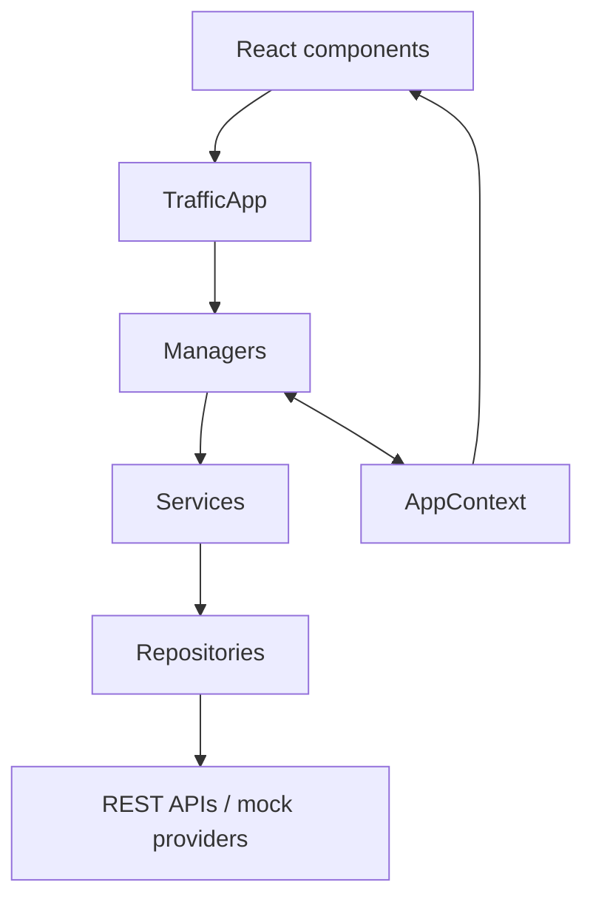
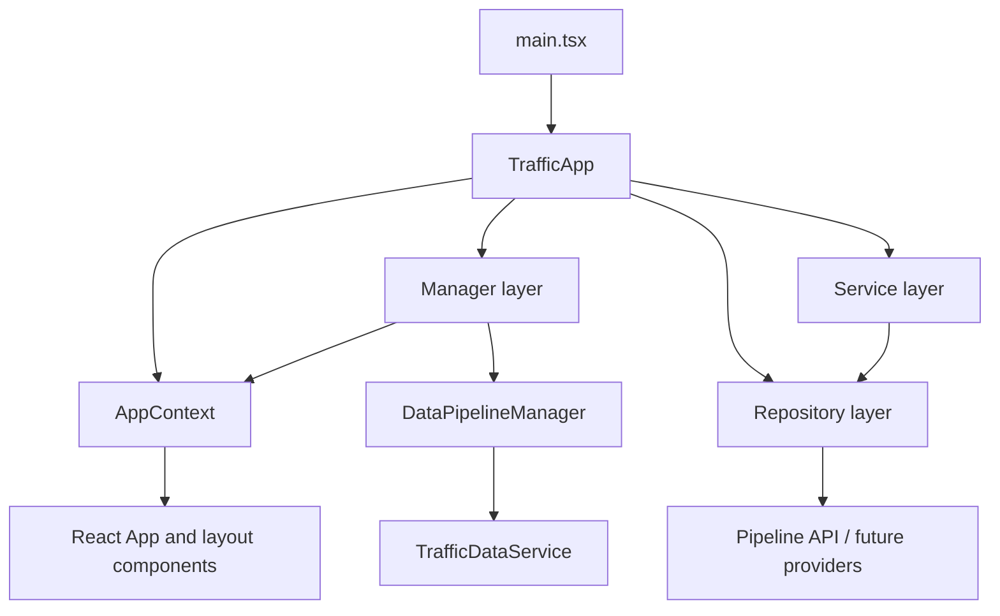
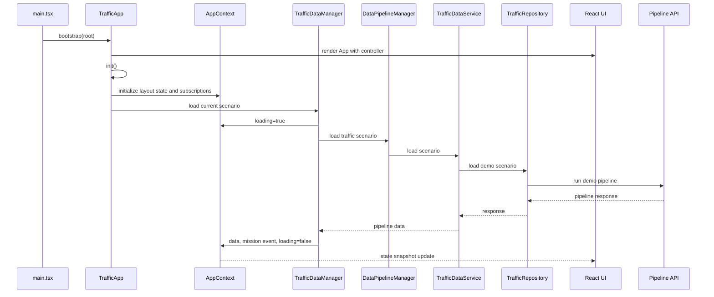

# Application Controller Architecture

## Current Architecture

Before this refactor, `App` owned frontend runtime state, initial pipeline loading, retry behavior, scenario changes, mission-log updates, and map-layer state. Layout components also retained interaction state. This made React rendering and application orchestration inseparable.

## New Architecture

`TrafficApp` is the frontend composition root. It constructs repositories, services, and managers; owns startup and disposal; and supplies the React rendering adapter with the application controller. React subscribes to `AppContext` snapshots and dispatches user intent only to public manager APIs.

## Layer Diagram

## Updated Dependency Graph

- **`TrafficApp`** is the sole composition root and creates every dependency without singletons.
- **Managers** coordinate AppContext updates and collaboration: layout, maps, events, traffic state, simulation, AI reasoning, replay, reporting, and external-data orchestration.
- **Services** contain small domain operations, such as request shaping, map-layer toggling, event construction, snapshot retention, and summary generation.
- **Repositories** isolate API and mock-data access. `TrafficRepository` is the only frontend layer that calls the current pipeline API.
- **React components** do not import repositories or services.

## Service and Repository Architecture

`DataPipelineManager` has a registry of camera feeds, Google Maps, weather, road works, signals, IoT, historical traffic, simulation outputs, and AI reasoning outputs. These are declared extension points only; current behavior continues to load the existing demo traffic pipeline through `TrafficDataService` and `TrafficRepository`.

## Initialization Flow

## Lifecycle

- **Bootstrap:** `TrafficApp.bootstrap()` renders the React adapter and invokes `init()`.
- **Initialize:** `init()` is idempotent, initializes manager coordination, and loads the default scenario.
- **Operate:** scenario, map, simulation, and reasoning actions are delegated to their respective managers.
- **Dispose:** `dispose()` removes subscriptions and unmounts the React root.

## Benefits

- **Clear ownership:** runtime state and lifecycle have one authoritative owner.
- **Testability:** manager dependencies are injected; orchestration tests use a fake pipeline client without rendering the UI.
- **Cohesion:** map, data, event, simulation, and reasoning behavior have focused modules.
- **Loose coupling:** UI depends on controller capabilities, not network or cross-panel implementation details.
- **Controlled growth:** new runtime services can be composed in `TrafficApp` without turning `App` into a service hub.

## Future Extension Points

- Replace the pipeline repository client with streaming or WebSocket data while retaining `TrafficDataManager`'s context contract.
- Add persisted replay playback to `ReplayManager`.
- Extend `ReportManager` to export decision artifacts from a context snapshot.
- Add a map adapter behind `MapManager` for MapLibre-specific imperative operations.
- Introduce feature-scoped managers only when they own runtime behavior and collaboration, not merely to wrap a component.

## Migration Summary

- Split the original manager module into focused modules, retaining `managers.ts` as a compatibility export surface.
- Moved API access into `TrafficRepository` and focused domain logic into lightweight services; managers now coordinate context state and service calls.
- Added `DataPipelineManager` as a declarative registry for future sources without changing the current demo pipeline behavior.
- Preserved dashboard rendering, API request shape, loading/error states, decision interactions, and MapLibre behavior.
- Added controller and service tests for startup, data loading, replay capture, manager actions, and repository-backed scenario loading.
