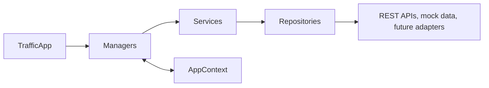

# Frontend Services and Repositories

## Purpose

The frontend uses four layers to keep runtime coordination separate from domain logic and external access:

## Responsibilities

### Managers

Managers coordinate application state and workflows. They update `AppContext`, call focused services, and expose the public APIs consumed by `TrafficApp` and React event handlers.

- **`MapManager`** manages selected intersections and visible-layer state.
- **`TrafficDataManager`** manages loading, errors, pipeline results, and mission-log updates.
- **`DataPipelineManager`** coordinates registered external-source entry points.
- **`SimulationManager`** and **`AIReasoningManager`** coordinate user actions with events.
- **`ReplayManager`** and **`ReportManager`** expose replay and reporting workflows.
- **`EventManager`** owns bounded mission-log updates.
- **`DashboardLayoutManager`** owns application layout initialization.

### Services

Services implement small reusable domain operations without UI dependencies.

- **`MapService`** provides default map visibility and immutable layer toggling.
- **`TrafficDataService`** shapes the current demo scenario request and translates successful responses to pipeline data.
- **`SimulationService`** and **`AIReasoningService`** create domain mission events.
- **`ReplayService`** retains bounded pipeline snapshots.
- **`ReportService`** generates a runtime summary from an application-state snapshot.

### Repositories

Repositories isolate the data source used by services.

- **`TrafficRepository`** is the only frontend caller of the typed pipeline API.
- **`MapRepository`** exposes current mock map configuration and is the replacement point for future GIS or provider adapters.

## Dependency Rules

- **Allowed:** `TrafficApp` → managers, services, repositories.
- **Allowed:** managers → services and `AppContext`.
- **Allowed:** services → repositories.
- **Allowed:** repositories → external providers or mock data.
- **Forbidden:** React → services or repositories.
- **Forbidden:** repositories → managers or React.
- **Communication:** managers coordinate through `AppContext` and explicit public interfaces; no singleton runtime state is used.

## Data Pipeline Extension Points

`DataPipelineManager` registers these future source identifiers without activating integrations:

- **`camera-feeds`**
- **`google-maps`**
- **`weather`**
- **`road-works`**
- **`signals`**
- **`iot`**
- **`historical-traffic`**
- **`simulation-outputs`**
- **`ai-reasoning-outputs`**

New providers should be added behind a repository and surfaced through a service before a manager incorporates their results into `AppContext`.

## Migration Rationale

- **Manager split:** improves ownership discovery and reduces merge conflicts without changing public controller properties.
- **Service layer:** places request shaping, event creation, state transformations, replay retention, and summary generation outside orchestration.
- **Repository layer:** prevents managers from calling APIs directly and creates an adapter seam for mocks or future providers.
- **Data pipeline registry:** records known integration scope now while deliberately avoiding speculative implementations.
- **Dependency injection:** keeps all construction in `TrafficApp`, making tests deterministic through injected clients instead of singleton replacement.
