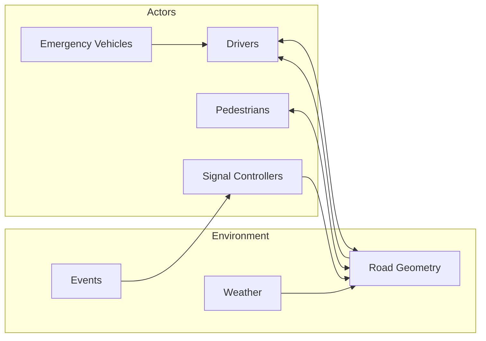
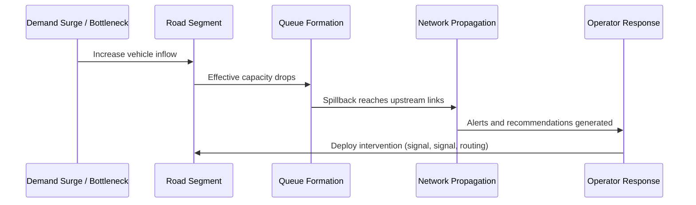
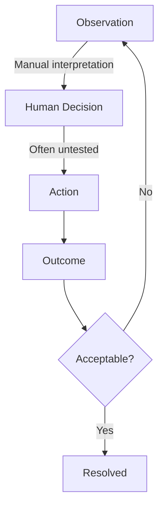
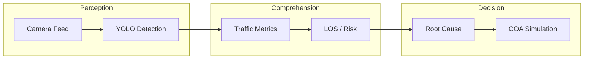

# 02-problem-domain

- **Title:** PROBLEM DOMAIN
- **Purpose:** TODO
- **Scope:** TODO
- **Status:** Draft
- **Version:** 0.1.0
- **Owner:** TODO

## Urban Mobility as a Complex Adaptive System

Urban traffic is a *complex adaptive system*: thousands of independent agents (drivers, pedestrians, emergency vehicles, signals, road geometry, weather) interact with each other and with infrastructure in non-linear ways. Local changes — a single stalled vehicle, a red-light timing shift, a school zone activation — can propagate through the network and produce large, unexpected effects kilometres away.

VayuGati Flow treats congestion not as an isolated event, but as an emergent property of the system. This framing is why the platform separates *observation* (Vision), *analysis* (Traffic Intelligence), and *synthesis* (Reasoning) into distinct engines, as detailed in [06-system-architecture.md](06-system-architecture.md).

## Characteristics of Urban Traffic Systems

| Characteristic | Description | Consequence for Operations |
|---|---|---|
| **Dynamic** | Demand, flow, and incidents change minute by minute. | Decisions based on stale data are often counter-productive. |
| **Networked** | Congestion at one node propagates to upstream and downstream links. | Single-intersection fixes can shift, not solve, the problem. |
| **Stochastic** | Driver behaviour, weather, and incidents are probabilistic. | Deterministic-only models miss rare but high-impact events. |
| **Constrained** | Road capacity is fixed in the short term and expensive to expand. | The most effective lever is optimising throughput of existing assets. |
| **Safety-Critical** | Mistimed interventions can create accidents or block emergency routes. | Recommendations must be validated before deployment. |

These characteristics are the foundation for the product strategy described in [03-product-strategy.md](03-product-strategy.md).

## Congestion as a Systems Failure

Traffic congestion is rarely caused by a single factor. It is the result of **demand exceeding effective capacity** at a point in space and time. Capacity can be reduced by:

- Physical bottlenecks (narrow lanes, construction, accidents).
- Behavioural anomalies (illegal parking, double parking, sudden braking).
- Control inefficiencies (poor signal timing, uncoordinated phases).
- Demand surges (school zones, office hours, events, emergencies).

Because the causes are interdependent, point solutions — adding a lane or adjusting one signal — often fail. The problem must be analysed as a system, and interventions must be simulated before they are fielded.

## Congestion Lifecycle

The lifecycle of a traffic incident follows a predictable pattern, and effective command-and-control must act at each stage:

| Stage | Phenomenon | Operational Need |
|---|---|---|
| **1. Onset** | Demand exceeds capacity; speed begins to fall. | Detect early with real-time or simulated data. |
| **2. Queue Formation** | Vehicles accumulate upstream of the bottleneck. | Quantify queue length and growth rate. |
| **3. Spillback** | Congestion spreads to adjacent intersections. | Predict propagation and side effects. |
| **4. Dissipation** | Demand drops or capacity is restored. | Measure recovery and intervention effectiveness. |

## Root Cause Analysis

Traditional dashboards report *what* is happening (volume, speed, occupancy). VayuGati Flow is designed to answer *why* it is happening. Probable root causes for the demo scenarios include:

| Scenario | Observable Symptom | Probable Root Cause | Example Intervention |
|---|---|---|---|
| **Morning Rush** | High volume, moderate speed | Demand exceeds capacity during peak period | Adaptive signal timing, peak-hour lane allocation |
| **School Zone** | Many stopped vehicles, low speed | Pedestrian activity and reduced speed limits | Pedestrian-phase optimisation, staggered crossing |
| **Accident** | Blocked lanes, stopped upstream traffic | Lane capacity reduction due to collision | Emergency lane clearance, reroute upstream traffic |
| **Illegal Parking** | Localised queue growth | Capacity reduction from vehicles in travel lane | Enforcement dispatch, tow-truck deployment |
| **Emergency Vehicle** | Through-traffic stalled with a priority vehicle | Conflicting movements at signalised intersection | Pre-emptive green wave for emergency corridor |

The functional capabilities that support root-cause identification are specified in [04-functional-requirements.md](04-functional-requirements.md).

## Existing Urban Traffic Technology Landscape

Current systems in the market generally fall into one of three categories, each with significant gaps:

| Category | Strength | Gap |
|---|---|---|
| **Traffic Sensors / ATCS** | Real-time volume and occupancy data. | Reactive; limited root-cause explanation. |
| **Video Analytics (VMS/CCTV)** | Visual confirmation of incidents. | Siloed; rarely tied to simulation or recommendation engines. |
| **GPS / Navigation Apps** | Broad pattern awareness and route guidance. | No signal-control authority; data not optimised for operators. |

VayuGati Flow closes these gaps by combining computer vision, deterministic traffic modelling, and AI reasoning in a single decision-support pipeline. See [01-executive-overview.md](01-executive-overview.md) for the product vision and [06-system-architecture.md](06-system-architecture.md) for the engine design.

## Observation–Action Gap

Most command centres have *observation* tools (CCTV, sensors) and *action* tools (signal controllers, dispatch), but the bridge between them is often human intuition. Operators must mentally translate video feeds and incident reports into intervention decisions. This creates:

- **Latency** between detection and response.
- **Inconsistency** across operators and shifts.
- **Risk of unintended side effects** when interventions are not simulated.

VayuGati Flow shortens this loop by inserting an *assessment and simulation* layer between observation and action, so interventions can be evaluated before deployment.

## Systems Thinking Framework

The platform applies systems thinking through three reinforcing loops:

1. **Perception Loop** — Cameras and sensors detect vehicles, classify them, and estimate motion.
2. **Comprehension Loop** — Traffic algorithms convert detections into metrics, Level of Service (LOS), and risk scores.
3. **Decision Loop** — AI reasoning explains the situation, proposes COAs, and simulates expected effects.

## Formal Problem Statement

> Urban traffic congestion is a systems-level failure caused by demand exceeding effective capacity at specific nodes and times. Existing tools provide observation and control, but they do not close the loop with automated root-cause analysis, intervention simulation, and evidence-based recommendations. Operators therefore make high-stakes decisions under uncertainty, often too late and without the ability to predict unintended consequences.

VayuGati Flow addresses this problem by building a **digital twin of the intersection** that enables operators to *observe, understand, simulate, and decide* in a single, integrated workflow. The solution is introduced at the executive level in [01-executive-overview.md](01-executive-overview.md), the strategic response is detailed in [03-product-strategy.md](03-product-strategy.md), and the required capabilities are enumerated in [04-functional-requirements.md](04-functional-requirements.md).
