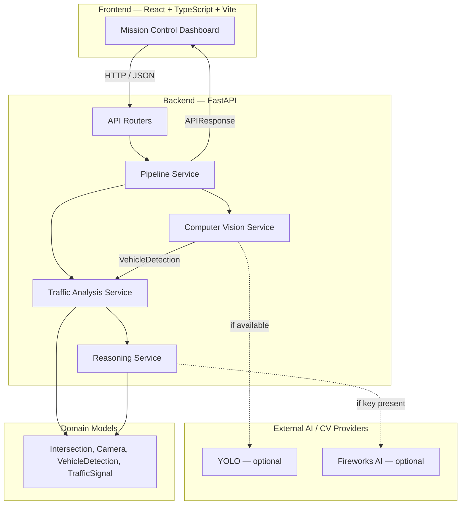
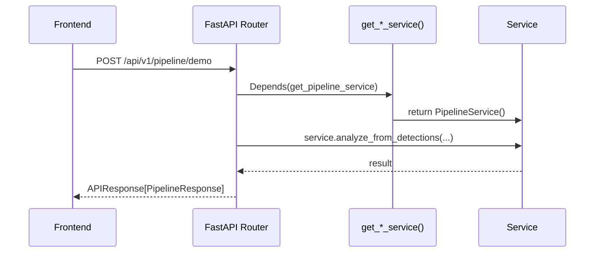
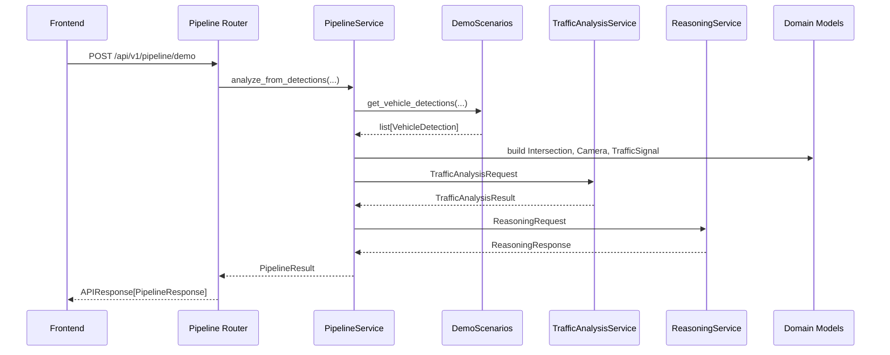

# 06-system-architecture

- **Title:** SYSTEM ARCHITECTURE
- **Purpose:** TODO
- **Scope:** TODO
- **Status:** Draft
- **Version:** 0.1.0
- **Owner:** TODO

## Purpose

This chapter documents the architecture of VayuGati Flow as it is implemented today. It is the source-of-truth reference for how the frontend, FastAPI backend, services, domain models, and API endpoints are wired together. It does not describe aspirational or unimplemented features; for the target architecture, see [15-roadmap.md](15-roadmap.md) and [07-digital-twin.md](07-digital-twin.md).

## Current Architecture Overview

VayuGati Flow is a request/response system composed of a React/TypeScript frontend, a FastAPI Python backend, and a set of independent engines. The frontend calls a single REST API, which dispatches requests to a service layer. The service layer orchestrates deterministic traffic analysis and an optional AI reasoning step, then returns a standardised payload to the dashboard.



The motivation for separating observation, analysis, and reasoning is explained in [02-problem-domain.md](02-problem-domain.md). Product goals and release phasing are described in [03-product-strategy.md](03-product-strategy.md).

## Repository Structure

The repository is organised into the following top-level directories:

| Directory | Purpose |
|---|---|
| `backend/` | FastAPI application, domain models, services, routers, schemas, and tests. |
| `frontend/` | React/TypeScript/Vite Mission Control dashboard. |
| `docs/` | Product, architecture, and governance documentation. |
| `simulation/` | Simulation assets and scenarios for analysis and demo purposes. |
| `assets/` | Static project assets such as diagrams and media. |
| `examples/` | Example payloads, request snippets, and integration references. |
| `ai_agents/` | AI agent definitions, prompts, and orchestration notebooks. |

### Backend Structure

```
backend/
├── main.py                 # FastAPI application entry point
├── app/
│   ├── config.py         # Pydantic settings, environment variables
│   ├── routers/          # FastAPI route handlers
│   ├── services/         # Business-logic services
│   ├── models/           # Domain models and enums
│   ├── schemas/          # Pydantic request/response schemas
│   └── utils/            # Shared utilities (algorithms, responses, logging)
├── tests/                # Pytest unit and integration tests
└── docs/                 # Backend-specific algorithm documentation
```

### Frontend Structure

```
frontend/
├── src/
│   ├── api/              # Axios API clients and typed interfaces
│   ├── components/
│   │   ├── layout/       # TopBar, LeftPanel, RightPanel, BottomPanel, MainArea
│   │   ├── map/          # OperationalMap, LayerControls, IntersectionPanel
│   │   └── panels/       # TrafficIntelligence, AIReasoning, DecisionIntelligence, etc.
│   ├── data/             # Mock GIS, operational-memory, and connector data
│   ├── lib/              # Utility hooks (e.g. useAnimatedValue)
│   ├── types/            # Shared TypeScript types
│   └── App.tsx           # Application root and pipeline data loader
├── package.json
└── vite.config.ts        # Vite dev server and /api proxy
```

## Backend Architecture

### FastAPI

`main.py` creates a FastAPI application with CORS middleware for the local Vite dev server and preview proxies. It mounts four routers under the configured `api_prefix` (`/api/v1` by default). The application uses Pydantic v2 for request/response validation and exposes OpenAPI documentation automatically at `/docs`.

### Routers

Routers are lightweight HTTP adapters that parse requests, call services, and return `APIResponse` envelopes.

| Router | File | Responsibility |
|---|---|---|
| `traffic` | `app/routers/traffic.py` | Exposes `POST /api/v1/traffic/analyze` for direct traffic analysis. |
| `vision` | `app/routers/vision.py` | Exposes `POST /api/v1/vision/analyze` for image/vehicle-detection analysis. |
| `reasoning` | `app/routers/reasoning.py` | Exposes `POST /api/v1/reasoning/analyze` for AI-generated insights. |
| `pipeline` | `app/routers/pipeline.py` | Exposes `POST /api/v1/pipeline/demo` and `GET /api/v1/pipeline/scenarios` for end-to-end demo orchestration. |

### Services

Services contain the application’s business logic and are injected into routers via FastAPI `Depends`:

| Service | File | Current Responsibility |
|---|---|---|
| `PipelineService` | `app/services/pipeline_service.py` | Orchestrates demo scenarios through Vision → Traffic → Reasoning. |
| `TrafficAnalysisService` | `app/services/traffic_analysis_service.py` | Computes deterministic traffic metrics from vehicle detections and domain models. |
| `TrafficService` | `app/services/traffic_service.py` | Wrapper / helper traffic calculations. |
| `ComputerVisionService` | `app/services/computer_vision_service.py` | Converts images to `VehicleDetection` objects; falls back to mock detections if YOLO/PIL unavailable. |
| `ReasoningService` | `app/services/reasoning_service.py` | Generates explanations, root causes, and recommendations; falls back to mock if Fireworks key missing. |
| `DemoScenarios` | `app/services/demo_scenarios.py` | Pre-configured scenario generators for the demo pipeline. |

### Schemas

Schemas define all request and response payloads using Pydantic v2. The `APIResponse[T]` wrapper in `app/schemas/common.py` is the standard envelope for every endpoint, providing `success`, `timestamp`, `data`, and `errors` fields.

### Domain Models

Domain models live in `app/models/` and are exposed through `app/models/__init__.py`. The current set is:

| Model | Key Attributes / Purpose |
|---|---|
| `Intersection` | `intersection_id`, `name`, `location_lat`, `location_lon`, `intersection_type`, `status`, `num_lanes`. |
| `Camera` | `camera_id`, `intersection_id`, `resolution`, `status`, `fps`. |
| `CameraFrame` | `frame_id`, `camera_id`, `timestamp`, `quality`. |
| `VehicleDetection` | `detection_id`, `vehicle_type`, `confidence`, `bbox_*`, `speed_kmh`, `direction_degrees`. |
| `TrafficSignal` | `signal_id`, `direction`, `current_phase`, `cycle_time_seconds`. |
| `TrafficMetrics` | Aggregate metrics computed by the traffic engine. |
| `CongestionAnalysis` | `congestion_level`, `congestion_cause`, `description`. |

For the data-dictionary and relationships between these models, see [08-data-model.md](08-data-model.md).

### Configuration

Configuration is centralised in `app/config.py` through `pydantic_settings`. Key settings include `api_prefix`, `app_name`, `app_version`, `fireworks_api_key`, `fireworks_model`, and `yolo_model_path`. The `.env` file is loaded automatically.

### Dependency Injection

FastAPI dependencies provide cached, stateless service instances:



## Request Lifecycle

A `POST /api/v1/pipeline/demo` request flows through the system as shown below. This is the primary end-to-end path used by the dashboard.



The traffic-only endpoint (`POST /api/v1/traffic/analyze`) follows a similar path but stops after the traffic-analysis step.

## Service Layer

### Traffic Intelligence Service

`TrafficAnalysisService` accepts a `TrafficAnalysisRequest` containing an intersection, camera, signal, vehicle detections, and roadway parameters. It computes deterministic metrics based on Highway Capacity Manual-style algorithms:

- Queue length
- Vehicle density
- Average speed
- Occupancy rate
- Congestion score
- Level of Service (LOS)
- Risk score

These calculations contain no AI/ML inference. The service returns a `TrafficAnalysisResult`.

### Reasoning Service

`ReasoningService` consumes the deterministic `TrafficAnalysisResult` and generates natural-language explanations, probable root causes, and traffic recommendations. It first attempts to call Fireworks AI (Llama 3 70B) when an API key is configured; otherwise it returns a deterministic mock response based on congestion thresholds. This is the only current AI integration point in the backend.

### Computer Vision Service

`ComputerVisionService` performs vehicle detection. It attempts to load an Ultralytics YOLO model and run inference on a base64-encoded image. If YOLO or PIL is not installed, or if inference fails, it returns mock `VehicleDetection` objects for the supplied request.

## API Layer

### Current Endpoints

| Method | Endpoint | Purpose |
|---|---|---|
| `GET` | `/` | Health / welcome message. |
| `GET` | `/api/v1/pipeline/scenarios` | List available demo scenarios. |
| `POST` | `/api/v1/pipeline/demo` | Run a demo scenario end-to-end. |
| `POST` | `/api/v1/traffic/analyze` | Analyse traffic from a domain model request. |
| `POST` | `/api/v1/vision/analyze` | Analyse an image and return detections. |
| `POST` | `/api/v1/reasoning/analyze` | Generate AI reasoning from traffic metrics. |

All endpoints return `APIResponse[T]` with `success`, `timestamp`, `data`, and `errors`. Detailed request/response contracts are the subject of [09-api-specification.md](09-api-specification.md).

## AI Integration

### Current AI Provider

- **Reasoning:** Fireworks AI (Llama 3 70B via OpenAI-compatible client) is wired into `ReasoningService`.
- **Computer Vision:** YOLO (Ultralytics) is wired into `ComputerVisionService`.

### Current Responsibilities

- The AI provider explains deterministic traffic metrics and recommends actions.
- It does **not** compute traffic metrics; that is the Traffic Intelligence Service's responsibility.
- The vision model detects and classifies vehicles from images.

### Current Limitations

- Fireworks AI is only called when `fireworks_api_key` is non-empty; otherwise the system returns deterministic mock responses.
- YOLO requires the model file (`yolov8n.pt`) and `PIL` to be available in the environment; otherwise the service returns two mock detections per request.
- The reasoning response is parsed from JSON returned by the LLM; malformed JSON falls back to defaults.

For the broader AI strategy and model selection, see [05-ai-architecture.md](05-ai-architecture.md).

## Testing

The backend test suite is located in `backend/tests/` and is written with `pytest`. It covers unit tests, service tests, API integration tests, and schema validation tests.

| Category | Example Test File |
|---|---|
| Traffic algorithms | `test_traffic_algorithms.py` |
| Traffic analysis service | `test_traffic_analysis_service.py` |
| Traffic API | `test_traffic_api.py`, `test_traffic_api_integration.py` |
| Vision API | `test_vision_api_integration.py` |
| Reasoning | `test_reasoning_service.py`, `test_reasoning_api_integration.py` |
| Schemas | `test_traffic_schemas.py` |

All routers have corresponding OpenAPI validation through FastAPI, and the `/docs` endpoint is expected to remain functional at all times. For the full testing strategy and coverage reporting, see the test directory and [00-document-control.md](00-document-control.md) for test-status conventions.

## Current Limitations

The following limitations exist in the current implementation:

| Limitation | Impact |
|---|---|
| **Single-node deployment** | The backend runs as a single Uvicorn process; no clustering, workers, or load balancing is configured. |
| **No authentication** | All API endpoints are public. |
| **No persistent database** | Scenario data, detections, and results are not stored between requests. |
| **Limited simulation** | Demo scenarios are pre-configured; real-time streaming and closed-loop signal control are not implemented. |
| **Optional AI fallbacks** | YOLO and Fireworks AI are not active unless dependencies and credentials are present. |
| **No async task queue** | All work is done synchronously within the HTTP request lifecycle. |
| **Single intersection** | The pipeline is scoped to one intersection per request. |

These limitations are the baseline the MVP is designed against. The problem statement and systems context are documented in [02-problem-domain.md](02-problem-domain.md).

## Future Evolution

The target architecture extends the current engine composition into a city-scale digital twin. Planned directions include:

- Adding a persistent storage layer (PostgreSQL / TimescaleDB) for historical trends.
- Introducing asynchronous workers for long-running vision and simulation jobs.
- Scaling from one intersection to thousands through a multi-node traffic graph.
- Integrating WebSocket or SSE channels for live dashboard updates.
- Moving toward real CCTV ingestion and live computer-vision pipelines.

The roadmap and sequencing for these changes are maintained in [15-roadmap.md](15-roadmap.md).
